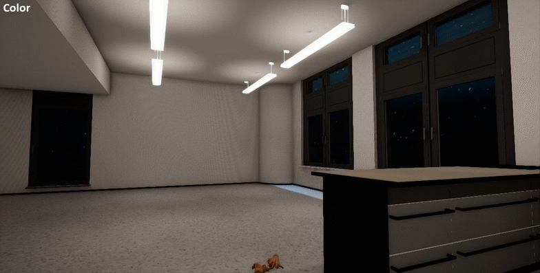
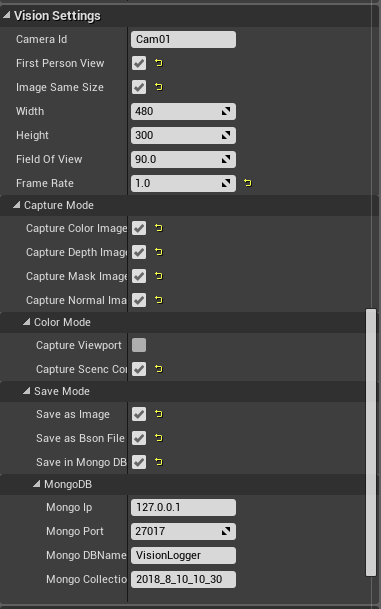
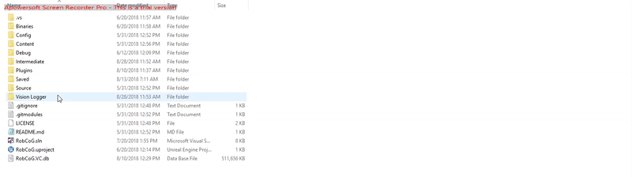
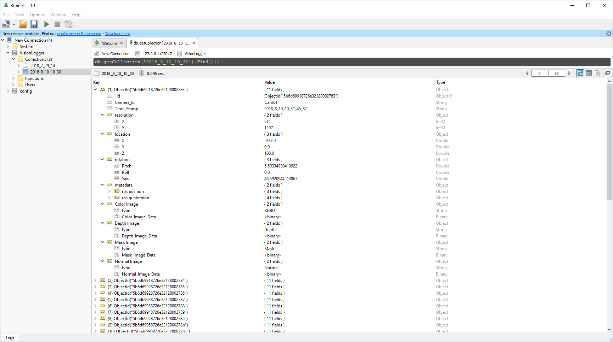

# URoboVision

Unreal plugin with a CameraActor that captures Color,Mask,Depth and Normal Images. And it can also save all images in [MongoDB](https://www.mongodb.com/) and [Bson](http://bsonspec.org/) file.

# Usage
*  Add the plugin to your project (e.g `MyProject/Plugins/UVisionLogger`)
*  Add [libmongo](https://github.com/robcog-iai/libmongo) to your project (e.g `MyProject/Plugins/libmongo`)
*  Drag and drop `UVCamera` to your level.

    
    
*  Set parameters in the [`Vision Settings`](Documentation/VisionSetting.md).

    
    
*  Drag multiple `UVCamera` to capture different views simultaneously.

# Demo result

* After running, all results are saved in folder **Vision Logger**. 
* Each Camera will create a folder of itself. 
* All images captured will be saved in folder **viewport**.
* When mask image is captured, corresponding mask colors are saved as bson file in folder **Mask Color**. 
* When **Save as Bson file** is chosen, it will create a folder **Bson File** to save all images in bson file.

* When **Save in Mongo** is chosen, you can view results as follow in MongoDB.

# Bson file reader helper

**[ReadBsonHelper.py](https://github.com/guanjianyu/URoboVision/blob/guan/ReadBsonHelper.py)** -- python script to read bson file and save all images in folder **Vision Logger/Bson_image_folder**.
* Usage: Change file path to your bson file path in this script. In Command line window, run **python ReadBsonHelper.py**

**[Read_Bson_helper.ipynb](https://github.com/guanjianyu/URoboVision/blob/guan/Read_Bson_Helper.ipynb)** -- jupyter notebook to read bson file and save all images in folder 

**[ReadMaskColorHelper.ipynb](https://github.com/guanjianyu/URoboVision/blob/guan/ReadMaskColorHelper.ipynb)** -- jupyter notebook to read Mask Color used in mask image.

# Future Work

* Mask Image capture can only be used in Editor Level. Since unreal 4.16,only the selected object's vertex color can be changed. The current solution is using [this code](https://github.com/guanjianyu/URoboVision/blob/guan/Source/UVisionLogger/Private/UVCamera.cpp#L872) to select all static Mesh actor, but this code can not be runned in launch game. Hopefully, some other solution can be found in future.

* It would be better if depth and Normal image can be got directly from Buffer visualization data. The way to access Gbuffer data has not be found. 

### Unreal Version: 4.19 
